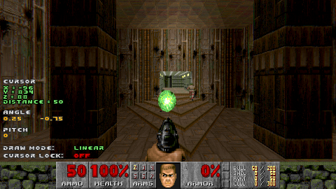

# Chapter 1 - Installation

**Cameraman** mod works on [ZDoom](https://zdoom.org/) family of source ports. 

Note that even though this documentation references **GZDoom** specifically, the mod should work on other ports from the family (such as LZDoom and older ZDoom). 

Having said that, the latest version of **GZDoom** is definitely recommended.

### Installation

1. Download the latest build from the [Releases page](https://github.com/borogk/zdoom-cameraman/releases) and extract the ZIP. Here's the contents you should expect:
```
CameramanEditor.pk3
CameramanPlayer.pk3
editor.ps1
player.ps1
settings.ps1
LICENSE
```

2. Make sure you have PowerShell 5.1+ installed.
   - Windows 10 and above should have it pre-installed
   - For other OS and older versions of Windows [see the installation guide](https://docs.microsoft.com/en-us/powershell/scripting/install/installing-powershell)

3. Check `settings.ps1` file and put the path to your ZDoom executable of choice:
```powershell
# By default, the mod seeks GZDoom executable in PATH 
# You may set it to the full path, like 'C:\Games\gzdoom\gzdoom.exe' or '/opt/gzdoom/gzdoom'
$GzdoomPath = 'gzdoom'  
```
4. Start the mod via `editor.ps1` with arguments specifying IWAD and level _(run this from the PowerShell console)_:
```
.\editor.ps1 -iwad doom2 -warp 1
```

In Linux / OSX use `pwsh` to run the script:
```
pwsh editor.ps1 -iwad doom2 -warp 1
```

_**Note** - every command line example in this manual will assume Windows. If you use other OS - adjust the command accordingly._

5. If everything went right, you should see the level with mod interface loaded:



Congratulations! Now we can start using the mod.

### Troubleshooting

When running **editor.ps1** from the PowerShell prompt in Windows, you may see this error:
```
File <...> cannot be loaded because running scripts is disabled on this system.
```

This happens because default Windows settings don't allow you to run random PowerShell scripts.
There are a few ways to fix this:

1. Allow running PowerShell script on the system. For that, start PowerShell console **as an administrator** and run this command:
```powershell
Set-ExecutionPolicy Bypass
```
2. If you are worried about changing system-wide security settings, you can limit them to a single PowerShell session like this:
```powershell
# Run this once before executing any scripts in a powershell session
Set-ExecutionPolicy Bypass -Scope Process
```

If you wish, read more about PowerShell security settings [in this article](https://www.netspi.com/blog/technical/network-penetration-testing/15-ways-to-bypass-the-powershell-execution-policy/).

### Up next

[Chapter 2 - Quick start](ch02.quick-start.md)
