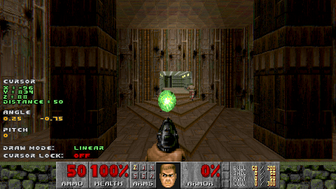

# Chapter 1: Installation

**Cameraman** mod works on [ZDoom](https://zdoom.org/) family of source ports. 

Note that even though this documentation references **UZDoom** specifically,
the mod should work on other ports from the family (such as GZDoom, LZDoom and older ZDoom). 

Having said that, the latest version of **UZDoom** is definitely recommended.

## Installation

> [!NOTE]
> Every command line example in this manual will assume Windows.
> If you use another OS, adjust the command accordingly (drop `.exe` from the binary name).

### Step 1: Download the latest build

> [!WARNING]
> Binaries listed below are unsigned and might trigger a security warning.

| File name                                                                                                                             | Platform    |
|---------------------------------------------------------------------------------------------------------------------------------------|-------------|
| [cameraman-v1.4.0-alpha1-windows-amd64.zip](https://github.com/borogk/cameraman/releases/download/v1.0.0/cameraman-v1.4.0-alpha1-windows-amd64.zip) | Windows x64 |
| [cameraman-v1.4.0-alpha1-linux-amd64.zip](https://github.com/borogk/cameraman/releases/download/v1.0.0/cameraman-v1.4.0-alpha1-linux-amd64.zip)     | Linux x64   |
| [cameraman-v1.4.0-alpha1-macos-arm64.zip](https://github.com/borogk/cameraman/releases/download/v1.0.0/cameraman-v1.4.0-alpha1-macos-arm64.zip)     | macOS ARM64 |

Here are the contents you should expect:
```
CameramanEditor.pk3
CameramanPlayer.pk3
cm-editor.exe
cm-player.exe
LICENSE
```

### Step 2: Set up ZDoom executable path

By default, Cameraman assumes `uzdoom.exe` (`uzdoom` on Linux / Mac).
This can be customized by setting `ZDOOM_BIN` environment variable.

### Step 3: Try it out

Start the mod via `cm-editor.exe` with arguments specifying IWAD and level:
```shell
.\cm-editor.exe -iwad doom2 -warp 1
```

If everything went right, you should see the level with mod interface loaded:



Congratulations! Now we can start using the mod.

> [!NOTE]
> It might be beneficial to add the installed directory to PATH,
> so that `cm-editor.exe` and `cm-player.exe` are always available in command prompt.

## Up next

[Chapter 2: Quick start](ch02.quick-start.md)
