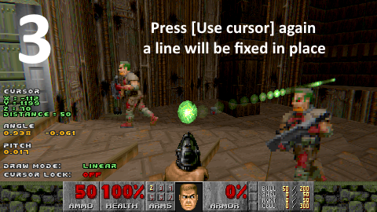

# Chapter 2 - Quick start

After loading the mod we can start doing camerawork.

First, check out beginner's [[TBD] tutorial on YouTube](). It gives a good idea on what the **Cameraman** mod can do.

Don't leave the text guides without attention - they have way more detail and much more convenient to fall back to when you become familiar with the mod.

### How to make a simple camera

First, if you loaded the mod correctly using `editor.ps1`, you may notice a few cheats are enabled automatically:
- you can to fly and pass through obstacles (`noclip2` cheat is activated)
- enemies ignore you (`notarget` cheat is activated)

These allow you to focus on camerawork without distractions.

Before you begin, go to `Options -> Customize controls`. Here you should see the **Cameraman** section:

Bind keys for two essential actions - `[Open menu]` and `[Use cursor]`. You may ignore other controls for now.

Now, get back to the game. The green blob in front of you is **the cursor** - it is used to draw a camera path.

Press `[Use cursor]`, move the cursor and press `[Use cursor]` again to draw a line.

Then, press `[Open menu]` and hit "Play" - the camera should activate!

Here's a step-by-step demonstration in picture format:

You can try drawing another path and try different positions and angles.

With the basics out of the way, let's continue onto more advanced usage.

### Up next

[Chapter 3 - Editor](ch03.editor.md)
