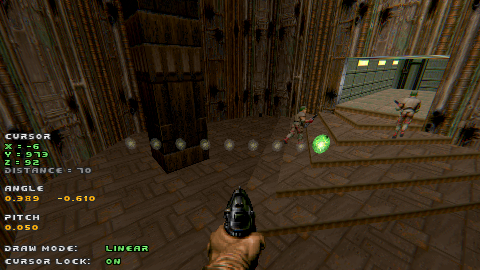

# Chapter 3 - Editor

Cameraman mod has two separate modules - **Editor** and **Player**.

We'll focus on the **Editor** first, as the other module enables more advance scenarios which you might not need.

This page is the longest and the most important part of the user manual, so buckle up!

### Setting up key bindings

To work effectively with the editor, we need to bind a few keys. 

Quick recap - in the [previous chapter](ch02.quick-start.md) we configured the first 2 essential keys:

Let's finish this and set up the rest:

The exact keys presented in the picture above are a default "recommendation", but they are not set automatically to avoid possible conflicts.
Set all of them as you see fit.

Because your setup might differ, this document shall refer to keys by the function name and not the key itself, i.e. `[Switch drawing mode]` (and not `[M]`).

### Controlling the cursor

Simply move around with `[WASD]` (or whatever you have configured) and move mouse to rotate the camera.
The editor, when started correctly, enables freelook and activates `noclip2` cheat to fly and pass through obstacles.

The cursor always keeps in front of you. Press `[Move cursor forward]` and `[Move cursor back]` to adjust the distance between the player and the cursor:

To lock the cursor in place, you may press `[Toggle cursor lock]`, this enables you to move freely and look at what are you drawing from all sides.
`[Move cursor forward]` and `[Move cursor back]` can still be used to the similar effect, but the cursor will stay in place when the player moves.

Pressing `[Toggle cursor lock]` switches back into the default mode.

To actually start drawing, press `[Use cursor]` and move around the cursor to see the preview (briefly shown in the [previous chapter](ch02.quick-start.md)).

### Opening the menu

All extra functions are moved the **Cameraman Menu**. Press `[Open menu]` to open it.
To exit the menu, press `[Esc]` key.

**Note** - the menu may not completely fit on the screen, scroll it down to see it in full.

Further down this manual will refer to the **Cameraman Menu** for various functions.

### Controlling draw modes

Resulting camera path shape and the process of drawing depend on which of the 3 **Draw modes** is selected. 

The 3 supported modes are **Linear**, **Radial** and **Bezier**. Press `[Switch drawing mode]` to cycle between them.
Also, note the "Draw mode" indicator in bottom left:

Next, we will learn how these draw modes work. 

It's **STRONGLY recommended** to read about the **Linear** mode first, as many basic concepts are also explained there.
You may then learn **Radial** and **Bezier** modes falling back on the existing knowledge.

### Up next

[Chapter 4.1 - Linear mode](ch04.01.linear.md)
