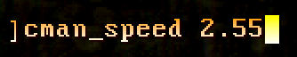

# Chapter 4.1 - Linear mode

_**Note** - this section not only explains how the **Linear** mode works, but also the meaning of nearly all the extra parameters.
It's crucial you understand the linear mode first, learning other modes builds on this knowledge!_

Linear mode makes the camera move in a simple straight line:

To draw a line interactively, follow these steps:
1. Make sure the draw mode is set to `Linear`
2. Point the cursor at the start point and press `[Use cursor]`
3. Move the cursor to the end point and press `[Use cursor]` again

This is what you should see in the end:

### Playback

To activate the camera and see the final results, press `[Play]` or open the **Cameraman Menu** and press `Play` there:

Status UI will disappear and the camera will activate:

_**Note** - play mode does not affect the game HUD, adjust it yourself if needed (using `[+]` and `[-]` keys by default)._

To disengage the camera at any point, press `[Play]` again.

### Adjusting parameters

Camera behavior is controlled entirely by a collection of special parameters.
They are stored in [CVARs](https://zdoom.org/wiki/CVARs) and control the following for **ANY** find of path (not only **Linear**):
- Path type and its defining coordinates
- Camera speed
- Camera angle and pitch

Let's start with coordinates. For a **Linear** path they are stored in following parameters:
- **X0, Y0, Z0** for starting point
- **X1, Y1, Z1** for ending point

Precise control over them can be found in the **Cameraman Menu**:

_**Note** - be careful with using the mouse on these sliders, it's too sensitive! Use the arrow keys instead._

Also, you can input parameters by setting corresponding CVARs directly in console.
All parameter names are in lower case and have `cman_` prefix:

_Note - Full reference of CVARs can be found in [Appendix A - List of CVARs](ap01.cvars.md)_

Pressing `[Play]` will immediately put new values into effect and start the playback.
To update the dotted preview line without engaging the camera, open the **Cameraman Menu** and press `Refresh path`:

### Camera angle

Now that we know how to change parameters, let's change the camera angle.

_**Note** - the term **"Angle"** in ZDoom refers to horizontal rotation only.
Vertical rotation is called **"Pitch"** and will be discussed further below._

Angle parameters use [ZDoom's fixed-point angle system](https://zdoom.org/wiki/Definitions#Fixed_point_angles):

- Angle values have a range of `[0.0, 1.0)`
- Zero value points in the East
- Values increase counter-clockwise and decrease clockwise

Values may go beyond `[0.0, 1.0)` range, they just repeat in cycles:
- `0.2` is the same as `1.2`, `2.2`, etc.
- Negative values are also valid, `0.2` is the same as `-0.8`, `-1.8` etc.

Camera angle is controlled by **A0** and **A1** parameters:
- **A0** is angle at the start
- **A1** is angle at the end
- While moving, the camera will smoothly transition between **A0** and **A1**
- If you don't want a transition, simply set **A0** and **A1** to the same value

Parameters can be adjusted in the **Cameraman Menu**:

There's also the **Angle mode** parameter, which has 2 options:
- **Relative** - `0.0` value points at the direction of camera path
- **Absolute** - `0.0` value always points East

In both cases, angles increase counter-clockwise.

If the difference between **A0** and **A1** is big enough, the camera will make full rotations.
For instance, given `A0 = 0.2` and `A1 = 2.3`, the camera will make 2 full rotations plus rotation of `0.1`.

### Camera pitch

Pitch is a vertical angle, and it works a bit differently from horizontal:
- Pitch values have a range of `[-0.25, 0.25]`
- Zero value points forward
- Positive values look down and negative values look up

Camera pitch is controlled by **P0** and **P1** parameters:
- **P0** is pitch at the start
- **P1** is pitch at the end

Transition between **P0** and **P1** works in the same manner as for angles.

There's no equivalent of **Relative** mode, because pitch values don't cover all 360 degrees.

### Camera speed

These 2 parameters control the speed of camera movement:
- **Speed mode** - can be set to **Distance** or **Time**, explained below
- **Speed** - numerical value, which sets the constant speed

Here's how the **Speed mode** parameter works:
- In **Distance** mode, the **Speed** value controls means amount of units per gametic (1/35 sec)
- In **Time** mode, the **Speed** value controls amount of gametics to travel the whole path

**Distance** mode is generally recommended, as it gives consistent results no matter the length of the path.
However, **Time** mode can be more convenient in some cases, especially for other path types.

Setting **Speed** to `0.0` will make the camera stall at the starting point regardless of the **Speed mode**. 
Camera angle and pitch don't transition and rely solely on **A0** and **P0** parameters.

You may want to set the speed value directly via `cman_speed` CVAR in console.
Due to the slider inaccuracies, exact speed values may be difficult to achieve from the menu.

### Tips and tricks

- **Relative** angle mode is better the viewport is following a path.
  - Setting `A0 = A1 = 0.0` will make the camera look forward while moving
  - Setting `A0 = A1 = 0.5` will make the camera look backwards while moving
- **Absolute** angle mode is better the viewport is looking at a particular object while the camera is just flying by
- You can use with Angle and Pitch status UI for a reference (angle has both positive and negative numbers reference):

### Up next

[Chapter 4.2 - Radial mode](ch04.02.radial.md)
