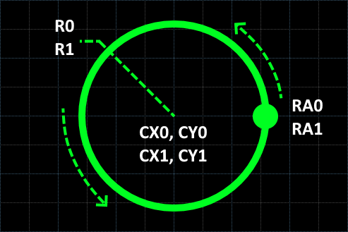
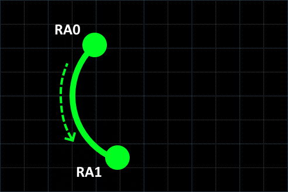
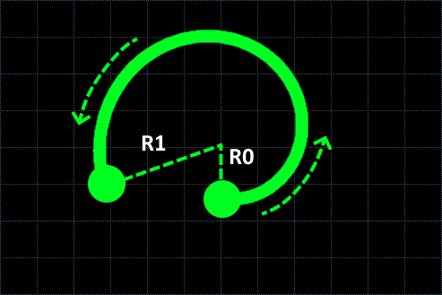
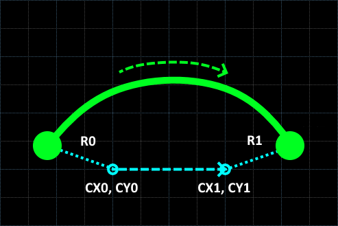
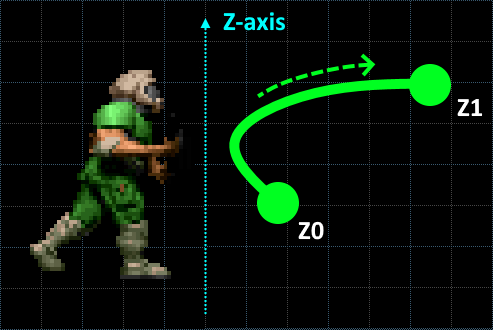
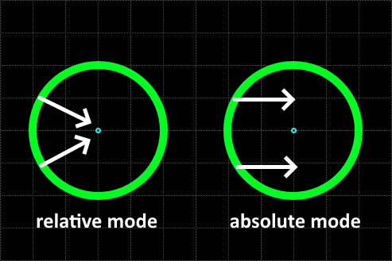
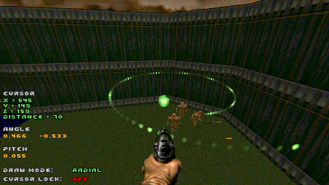

# Chapter 4.2 - Radial mode

_**Note** - make sure you've read [Chapter 4.1 - Linear mode](ch04.01.linear.md) first! It explains a few base concepts which won't be explained here._

### Defining parameters

Radial mode makes the camera move in a circular pattern:

Several parameters control the path's shape.

**RA0** and **RA1** define start and end angle. By default `RA0 = 0.0` and `RA1 = 1.0`, which makes a full circle, 
but you may change them to other values and create an arc:

**R0** and **R1** define radius in the start and in the end respectively. If `RA0 = RA1`, then we have a circle, but having different values makes a spiral:

**CX0, CY0** define starting center point and **CX1, CY1** define ending center point. 
If these are two different points, the path will be gradually shifting its center:

Finally, **Z0** and **Z1** define the curve Z value in the start and in the end respectively:

### Camera angle

**A0** and **A1** parameters set the camera angle in the start and in the end.

Regarding angle modes:
- In **Relative** angle mode the value of `0.0` points towards the path center
- In **Absolute** angle mode the value of `0.0` always points East

In both cases, angles increase counter-clockwise.

### Camera pitch

Pitch is controlled by **P0** and **P1** parameters in the same way as in the [**Linear** mode](ch04.01.linear.md).

### Camera speed

In **Distance** mode the **Speed** parameter measures angular speed (not linear speed!).
For example, given `RA0 = 0.00`, `RA1 = 0.35`, `Speed = 0.01` it will take 35 gametics to get from the beginning to end regardless of the radius.

In **Time** mode, the speed works in the same way as in the [**Linear** mode](ch04.01.linear.md).

### Drawing interactively

To draw a radial interactively, follow these steps:
1. Make sure the draw mode is set to `Radial`
2. Point the cursor at the center point and press `[Use cursor]`
3. Move the cursor to adjust **R0** radius and **Z1** and press `[Use cursor]` again
4. Move the cursor to adjust **R1** radius and press `[Use cursor]` again

This is what you should see in the end:

Keep in mind, while drawing a radial path interactively, you have a limited control over following parameters:
- **RA0** will always reset to `0.0`
- **RA1** will always reset to `1.0`
- **CX0, CY0** will always be equal to **CX1, CXY**

At this time, the **Cameraman Editor** only allows to adjust these parameters manually.

### Tips and tricks

- Radial mode is tricky to draw interactively, it's better to fine-tune it by setting parameters manually
- Use the radial mode to orbit an object
- Set different `CX0, CY0` and `CX1, CY1` points to orbit a moving object
- If `RA0 < RA1` - the path will progress counter-clockwise, if `RA0 > RA1` - counter-clockwise
- A few recipes for **Relative** angle mode:
    - Setting `A0 = A1 = 0.0` will make the camera look at the point you are orbiting
    - Setting `A0 = A1 = 0.25` (or `-0.25`) will make the camera follow the path's direction (forward or backward depending on whether it's clockwise or counter-clockwise)
- Use Angle status UI for a reference while setting parameters

### Up next

[Chapter 4.3 - Bezier mode](ch04.03.bezier.md)
