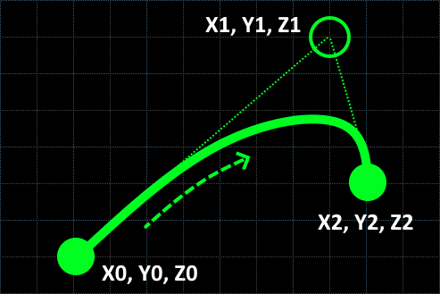
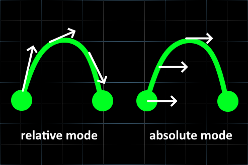
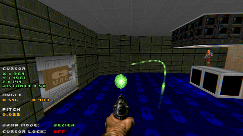

# Chapter 4.3 - Bezier mode

_**Note** - make sure you've read [Chapter 4.1 - Linear mode](ch04.01.linear.md) first! It explains a few base concepts which won't be explained here._

### Defining parameters

Bezier mode makes the camera follow a [quadratic Bezier spline](https://en.wikipedia.org/wiki/B%C3%A9zier_curve#Quadratic_B%C3%A9zier_curves):

The path's shape is controlled by 3 points:
- `X0, Y0, Z0` define a curve beginning
- `X1, Y1, Z1` defines a middle control point, which bends the curve
- `X2, Y2, Z2` define a curve end

The further you move the middle control point away from `X0, Y0, Z0` - `X2, Y2, Z2` line, the more extreme the curve will be.

### Camera angle

**A0** and **A1** parameters set the camera angle in the start and in the end.

Regarding angle modes:
- In **Relative** angle mode the value of `0.0` turns with the curve and points towards tangent
- In **Absolute** angle mode the value of `0.0` always points East

In both cases, angles increase counter-clockwise.

### Relative angle smoothing

Relative angle mode uses signal smoothing, averaging raw values from neighboring frames.
This reduces the noise happening due to fixed-point math precision problems and prevents jittery camera movements. 

The amount of frames in the smoothing window can be adjusted with **"Angle smoothing"** parameter (`cman_ga_buffer_len` CVAR). 

**Note** - bigger **"Angle smoothing"** numbers will result in less noise, but the camera turning will be less precise.
For optimal results, increase the setting only to the point when you are satisfied with the smoothness and don't increase further.

Absolute angle mode skips the smoothing. Setting **"Angle smoothing"** to 1 also completely disables it.

### Camera pitch

Pitch is controlled by **P0** and **P1** parameters the same way as for the [Linear path](ch04.01.linear.md).

### Camera speed

**Distance** speed mode is not supported by the Bezier mode. Camera will always move as if the **Time** mode is selected.

**Time** speed mode works the same as for the [Linear path](ch04.01.linear.md).

### Drawing interactively

To draw a Bezier path interactively, follow these steps:
1. Make sure the draw mode is set to `Bezier`
2. Point the cursor at the start point and press `[Use cursor]`
3. Move the cursor to the end point and press `[Use cursor]` again
4. Move the cursor to the middle control point and press `[Use cursor]` again

This is what you should see in the end:

### Tips and tricks

- Bezier can be a convenient substitute for drawing an arc in Radial mode
- Keep in mind, Z axis values also matter to the curve shape
- To have a better look at the preview while drawing, use cursor lock feature

### Up next

[Chapter 4.4 - Point and shoot mode](ch04.04.point-and-shoot.md)
