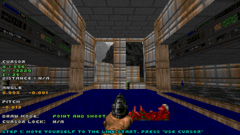
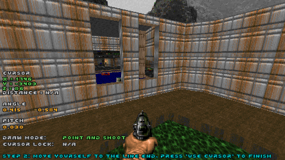
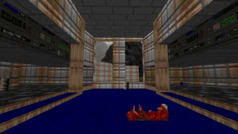

# Chapter 4.4 - Point and shoot mode

_**Note** - make sure you've read [Chapter 4.1 - Linear mode](ch04.01.linear.md) first! It explains a few base concepts which won't be explained here._

**Point and shoot** mode provides a simplified method of creating [linear](ch04.01.linear.md) camera paths.

Rather than using a cursor and manually adjusting the angles, it automatically captures position and aiming angle of
the player at two points and then interpolates between them.

### Defining parameters

This mode uses the same parameters as the Linear mode. Most of them are captured from the player POV, such as:
- **X0, Y0, Z0** position is taken from the player's start point
- **X1, Y1, Z1** position is taken from the player's end point

### Camera angle and pitch

- **A0, P0** are taken from the direction where the player was looking at the start
- **A1, P1** are taken from the direction where the player was looking at the end
- **Absolute** angle mode is set automatically, because the player is looking at specific absolute angles while capturing 

**Note** - A0 and A1 are auto-adjusted to select the shortest turning arc. 
If you meant to turn the other (longer) way, manually change the angles.

### Drawing interactively

To draw a "point and shoot" line, follow these steps:
1. Make sure the draw mode is set to `Point and shoot`
2. Position yourself at the starting point and press `[Use cursor]`
3. Move yourself to the end point and press `[Use cursor]` again

This would make a linear path between the two captured points. See example pictures below.

Start point:

End point:

Result:

### Tips and tricks

- While this mode captures most parameters automatically, you still may need / want to tweak them a bit by hand
- An easy way to flip the turning direction is to add / subtract 1.0 from `A1` (remember - angles increase counter-clockwise)
  - For example, let's assume `A0 = 0.9, A1 = 1.1` angles were auto-captured
  - Interpolating from `0.9` to `1.1` would turn the camera counter-clockwise, because the end value is higher
  - Subtracting 1 from `A1` would make the camera turn to the same exact position, but this time clockwise (decreasing from `0.9` to `0.1`)

### Up next

[Chapter 5 - Player](ch05.player.md)
