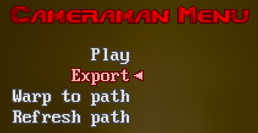

# Chapter 4 - Player

Often times the **Editor** module is enough by itself. You may set up a camera profiles and play them - all in a single tool.

However, you might want to capture complex interactions, such as gameplay or in-engine animated scenes. 
It can be challenging or even impossible to catch the right moment and hit the play button.

This is what the **Player** module is made for. It enables the following workflow:
1. Use the **Editor** to create and export a `.cman` profile
2. Run your scene with the **Player** and a `.cman` profile loaded (alongside other mods you may need)
3. The camera will activate automatically at the desired time
4. Capture a video clip.

Make multiple profiles with different delays to cover the entire scene with camera shots from different angles.

Then, capture video clips one-by-one, edit them together - and you have a movie!

Also, it's a good idea to keep the source camera profiles (these `.cman` files). You can always go back to adjust or replace them and re-capture select video clips.

### Camera profile format

The contents of `.cman` file are meant to be human-readable, here's an example:
```
path_mode = 2
angle_mode = 1
delay = 55
speed = 75
overshoot = 0
x0 = 6000
x1 = 6300
x2 = 6700
y0 = -2000
y1 = -1800
y2 = -2000
z0 = 130
z1 = 150
z2 = 170
a0 = 0
a1 = 0.3
p0 = 0.05
p1 = 0.05
```

These are the same values described in chapters **4.1, 4.2 and 4.3**.

When the **Player** loads a profile, its values are put into corresponding CVARs.

Notice `delay` value - it governs the camera start time. When the level is loaded, the **Player** waits the amount of gametics specified in `delay` and only then sets off the camera.

### How to export a camera profile from Editor

First, start the editor:

```
.\editor.ps1 <args>
```

Then, make a camera profile, open editor menu and hit `Export`:



Then, exit GZDoom. Note the `Exported <path to .cman file>` line in console output - that's your camera profile.


You may export multiple profiles during a single **Editor** session - multiple `.cman` files will be generated.

### How to load a camera profile into Player

Now we finally get to use `player.ps1`. It works much the same as `editor.ps1`, such as passes arguments to GZDoom, 
but it also has a special `load` command:

```
.\player.ps1 load export-xxxx.cman <args>
```

Args to the right of `load export-xxxx.cman` will be passed as-is to GZDoom executable.

Example: 
```
.\player.ps1 load export-0001.cman -iwad doom2 -file sunlust.wad -warp 3
```

After the level is loaded, the camera will activate automatically (accounting for `delay` value). Don't forget to capture a video!

### Usage with saves

You might want to use saves and loads in your production. 

If the scene is relatively long, you'll have to make profiles with long delays and waste a lot of time waiting for the camera to activate.

You can cut the waiting time by making saves in the middle of the scene and then loading them to fast-forward.

There's a small caveat - GZDoom remembers which mods you have when the game is saved. And it won't let you load a savefile unless the same exact mods are loaded too!

That's why if you want to use saves and loads with the **Player** module, start GZDoom like this:

```
.\player.ps1 <args>
```

Notice - there's no `load export-xxxx.cman`. No camera profile will be activated, yet the **Player** module will be loaded. It will stay dormant just to be present in the save info.

Then, you can simply load both camera profile and savefile like this:

```
.\player.ps1 load export-xxxx.cman -loadgame save.zds <other args>
```

Don't worry - there are no restrictions on using different camera profiles with the same savefile.
Camera profile is using CVARs in `nosave` scope, so they are not affected by saves and loads.

### Up next

[Chapter 6 - For developers](ch06.developers.md)
